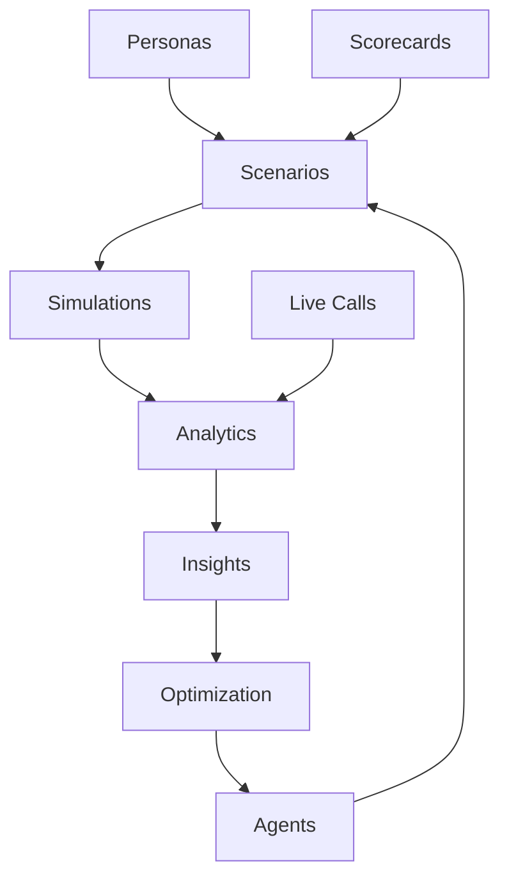

# Welcome to Chanl

Chanl helps you build reliable AI voice agents by making it easy to test them before they talk to customers, monitor them while they work, and continuously improve their performance based on real data.

## Why Chanl?

If you're building AI voice agents for customer service, sales, or support, you face three critical challenges:

1. **Testing is hard** - How do you know your agent will handle every type of customer before going live?
2. **Monitoring is complex** - Once live, how do you catch issues in real-time before they impact customers?
3. **Improvement is guesswork** - Without data, how do you know what to fix and whether changes actually help?

Chanl solves these problems by giving you a complete platform to test, observe, and optimize your AI agents throughout their lifecycle.

## How Chanl Works

Think of Chanl as your AI agent quality assurance system. Here's the workflow:

### 1. Test Your Agents Before They Go Live

Create realistic test scenarios by combining:
- **Scenarios** - The situations your agent needs to handle (e.g., "angry customer requesting refund")
- **Personas** - Different customer personalities and behaviors (e.g., "frustrated customer" or "price-sensitive buyer")
- **Scorecards** - Your quality standards for evaluating performance

Run automated simulations that test every persona-agent combination, giving you confidence before launch.

<Info>
**Example**: With 5 personas and 3 agent variants, Chanl automatically runs 15 simulations and scores each one against your quality criteria.
</Info>

### 2. Monitor Everything in Real-Time

Once your agents are live, Chanl watches every conversation:
- **Live Call Monitoring** - See ongoing calls and intervene when needed
- **Automated Alerts** - Get notified immediately when something goes wrong
- **Analytics Dashboard** - Track performance trends and identify patterns

### 3. Optimize Based on Real Data

Use insights from tests and real calls to improve:
- **Prompt Library** - Test different agent instructions and track what works
- **Fine-Tuning** - Turn successful conversations into training data
- **Tool Management** - Add capabilities and integrations your agents need

## The Three Core Workflows

<CardGroup cols={3}>
  <Card title="Test" icon="waypoints" href="/chanl/test/scenarios">
    Build automated test scenarios to validate agent behavior before deployment
  </Card>
  <Card title="Observe" icon="chart-no-axes-combined" href="/chanl/observe/analytics">
    Monitor live calls and analyze historical performance with real-time alerts
  </Card>
  <Card title="Optimize" icon="bot" href="/chanl/optimize/agents">
    Improve agent performance using data-driven insights and continuous refinement
  </Card>
</CardGroup>

## Quick Start Guide

Here's how to get your first agent tested and monitored in Chanl:

### Step 1: Connect Your Agent

```bash
# Connect your VAPI or Bland agent
curl -X POST https://api.chanl.ai/v1/agents/connect \
  -H "Authorization: Bearer YOUR_API_KEY" \
  -H "Content-Type: application/json" \
  -d '{
    "provider": "vapi",
    "agent_id": "your-agent-id"
  }'
```

Chanl automatically syncs your agent configuration, including prompts and tools.

### Step 2: Create Test Personas

Define the types of customers your agent needs to handle:

<AccordionGroup>
  <Accordion title="Frustrated Customer">
    A customer who is upset and needs quick resolution. Uses short responses and may interrupt.
  </Accordion>
  <Accordion title="Detail-Oriented Customer">
    Asks many specific questions and needs thorough explanations before making decisions.
  </Accordion>
  <Accordion title="Price-Sensitive Buyer">
    Primarily concerned with cost and value. Compares options and negotiates.
  </Accordion>
</AccordionGroup>

You can create these in the UI or via API - [see Personas documentation](/chanl/test/personas).

### Step 3: Design Your First Scenario

Create a test scenario that combines your personas with your agent:

```javascript
{
  "name": "Refund Request Handling",
  "prompt": "Customer purchased a product 2 weeks ago and wants a refund because it doesn't meet their expectations.",
  "personas": ["frustrated", "detail-oriented"],
  "agents": ["your-agent-id"],
  "scorecard": "customer-service-quality"
}
```

This will run 2 simulations (2 personas × 1 agent) automatically.

### Step 4: Review Results

Check your simulation scores in the Analytics dashboard or via API:

```bash
curl https://api.chanl.ai/v1/simulations?scenario_id=SCENARIO_ID \
  -H "Authorization: Bearer YOUR_API_KEY"
```

Each simulation includes:
- **Score** - Overall quality rating based on your scorecard
- **Transcript** - Full conversation text
- **Audio** - Recording of the interaction
- **Analysis** - AI-powered insights on what went well and what needs improvement

### Step 5: Set Up Monitoring

Enable live monitoring and alerts for your production agent:

<Steps>
  <Step title="Configure Alerts">
    Set up automated alerts for compliance issues, customer frustration, or quality drops
  </Step>
  <Step title="Enable Live Monitoring">
    Access the Live Calls dashboard to watch ongoing conversations
  </Step>
  <Step title="Review Analytics">
    Check daily performance trends and identify optimization opportunities
  </Step>
</Steps>

## Common Use Cases

### For Call Center BPOs

**Challenge**: Need to validate AI agents can handle high-volume customer service before replacing human agents.

**Solution**: Use Chanl to:
- Test agents against hundreds of customer scenarios automatically
- Monitor live calls with real-time alerts for issues
- Generate compliance reports for quality assurance
- Compare agent performance across different configurations

### For Developers

**Challenge**: Building custom AI voice agents but lack tools to test and debug conversation flows.

**Solution**: Use Chanl's API to:
- Programmatically create scenarios and personas
- Automate testing workflows
- Fetch simulation results for quality validation
- Monitor production agents and get alerts via webhooks

```javascript
// Example: Automated quality validation
const chanl = require('@chanl/sdk');

await chanl.scenarios.create({
  name: 'Refund Flow Test',
  personas: ['frustrated', 'analytical'],
  agents: ['staging-agent'],
  scorecard: 'customer-service'
});

const results = await chanl.simulations.waitForResults(scenarioId);
if (results.averageScore < 85) {
  throw new Error('Agent quality below threshold');
}
```

## Platform Architecture

Understanding how Chanl components work together:



**Key Relationships**:
- **Scenarios** combine Personas, Agents, and Scorecards to define tests
- **Simulations** are the results when you run a Scenario
- **Analytics** aggregate data from both Simulations and Live Calls
- **Insights** from Analytics feed back into Agent optimization

## What's Next?

Choose your path based on what you need right now:

<CardGroup cols={2}>
  <Card title="Start Testing" icon="waypoints" href="/chanl/test/scenarios">
    Create your first test scenario and run simulations
  </Card>
  <Card title="Monitor Live Calls" icon="eye" href="/chanl/observe/live-calls">
    Set up real-time monitoring for your production agents
  </Card>
  <Card title="Explore the API" icon="code" href="/api-reference/introduction">
    Integrate Chanl into your development workflow
  </Card>
  <Card title="Build Better Prompts" icon="sparkles" href="/chanl/optimize/prompts">
    Use the prompt library to improve agent behavior
  </Card>
</CardGroup>

## Need Help?

<CardGroup cols={3}>
  <Card title="Documentation" icon="book" href="/chanl/test/scenarios">
    Explore detailed guides for every feature
  </Card>
  <Card title="API Reference" icon="code" href="/api-reference/introduction">
    Complete API documentation with examples
  </Card>
  <Card title="Support" icon="life-ring" href="https://www.linkedin.com/company/chanl-ai">
    Contact our team for assistance
  </Card>
</CardGroup>